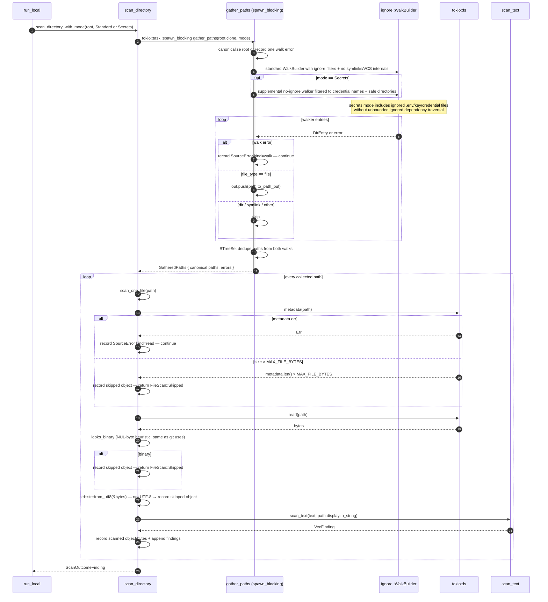
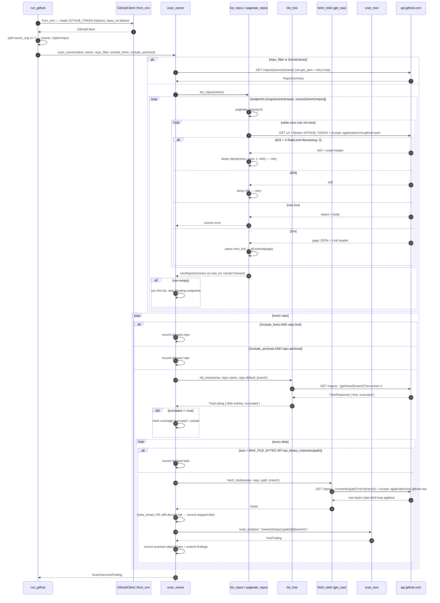
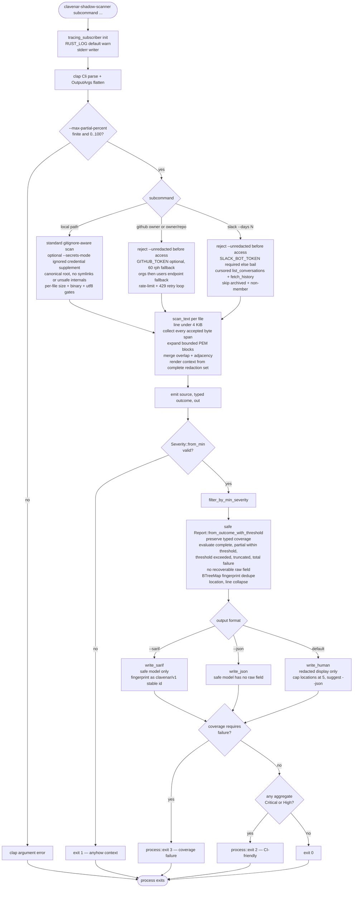

# clavenar-shadow-scanner sequence diagrams

Five sequence diagrams covering the wire-level paths the scanner can
take: CLI dispatch + the shared `emit` pipeline, the gitignore-aware
local-filesystem scan, the GitHub org / repo scan with rate-limit
backoff, the Slack workspace scan, and the per-line detector engine
that turns matched bytes into a typed `ScanOutcome` and deduped `Report`. A flowchart at the
end captures the request decision tree (source × output × severity
filter × exit code).

The scanner is a single CLI binary, so the diagrams highlight the
boundaries it crosses: the local filesystem (via the `ignore` crate),
`api.github.com` (REST + ETag-free polling), `slack.com/api`
(cursored history), and stdout (human / JSON / SARIF).

## 1. CLI dispatch + the shared `emit` pipeline

`main` reads as a sequential pipeline: tracing init (default `warn`)
→ clap `Cli::parse` → dispatch to one of three async runners → each
calls the safe `emit` path to filter, group, format, and choose exit 0/2/3 from
coverage policy and `any_high` aggregation (coverage failure exits 3 before a
finding can exit 2). Explicit local `--unredacted` dispatches through
`scan_directory_unredacted` and `emit_unredacted`; GitHub and Slack reject that
flag before source access, and clap rejects its use with SARIF.

```mermaid
sequenceDiagram
    autonumber
    participant Op as Operator shell
    participant Main as main
    participant Cli as clap Cli::parse
    participant Run as run_local / run_github / run_slack
    participant Src as sources::mod::scan_*
    participant Emit as emit
    participant Sev as Severity::from_min + filter_by_min_severity
    participant Rep as Report / UnsafeReport
    participant Out as write_human / write_json / write_sarif

    Op->>Main: clavenar-shadow-scanner subcommand [...]
    Main->>Main: tracing_subscriber::registry + EnvFilter (default warn, stderr writer)
    Main->>Cli: parse argv + env
    Cli-->>Main: Cli { command, local secrets_mode, OutputArgs { json, sarif, unredacted, severity_min, max_partial_percent } }
    break Command::Local with --unredacted
        Main->>Run: run_local(path, out)
        Run->>Src: sources::local::scan_directory_unredacted(path)
        Src-->>Run: ScanOutcomeUnsafeFinding (raw retained deliberately + typed coverage)
        Run->>Emit: emit_unredacted(source, outcome, out)
        Emit->>Rep: UnsafeReport::from_outcome_with_threshold
        Note over Emit,Rep: human banner; JSON unsafe_output=true + warning; no SARIF writer
        Rep-->>Emit: UnsafeReport carrying mandatory warning
        Emit->>Out: write unsafe human or JSON
        Out-->>Op: visibly marked secret-bearing payload
    end
    alt Command::Local safe default
        Main->>Run: run_local(path, secrets_mode, out)
        Run->>Src: sources::local::scan_directory_with_mode(path, mode)
    else Command::Github
        Main->>Run: run_github(owner_arg, include_forks, include_archived, out)
        Run->>Run: reject --unredacted before client/source access
        Run->>Run: split owner/repo on first '/'
        Run->>Src: sources::github::scan_owner(client, owner, repo_filter, include_forks, include_archived)
    else Command::Slack
        Main->>Run: run_slack(days, out)
        Run->>Run: reject --unredacted before token/source access
        Run->>Src: sources::slack::scan_workspace(client, lookback_days)
    end
    Src-->>Run: ScanOutcomeFinding (safe findings + typed coverage)
    Run->>Emit: emit(source_label, outcome, out)
    Emit->>Sev: Severity::from_min(out.severity_min) — error if invalid
    Sev->>Emit: Severity enum
    Emit->>Sev: outcome.map_findings(filter_by_min_severity)
    Sev-->>Emit: filtered ScanOutcomeFinding
    Emit->>Rep: Report::from_outcome_with_threshold(source, filtered outcome, max_partial_percent)
    Note over Emit,Rep: safe Finding, Aggregate, and Report models contain no recoverable raw value
    Rep-->>Emit: Report { source, scanned_at, coverage, coverage_evaluation, aggregates, total_findings }
    alt out.sarif
        Emit->>Out: report.write_sarif(stdout)
    else out.json
        Emit->>Out: report.write_json(stdout)
    else
        Emit->>Out: report.write_human(stdout)
    end
    Out-->>Op: stdout payload
    alt coverage status is threshold_exceeded, truncated, or total_failure
        Emit-->>Op: process::exit(3) — coverage failure takes precedence
    else accepted coverage
        Emit->>Emit: any_high = aggregates.iter().any(Critical or High)
    end
    alt accepted coverage and any_high
        Emit-->>Op: process::exit(2)  — CI-friendly
    else accepted coverage and no critical or high (or filtered out)
        Emit-->>Op: exit 0
    end
    Note over Main,Op: item/source failures stay in coverage; setup or fatal errors before an outcome exit 1
```

## 2. `local` — gitignore-aware filesystem walk

`scan_directory_with_mode` canonicalizes the requested root, pushes the
synchronous `ignore::WalkBuilder` walk onto the blocking pool, deduplicates
candidate paths, then reads + scans each file asynchronously. Standard mode
uses normal ignore filters while excluding VCS internals and symlinks. Secrets
mode supplements that set with ignored credential-oriented filenames, without
entering VCS, dependency, build, virtualenv, or cache directories. Per-file the metadata
size cap, the NUL-byte binary heuristic, and the UTF-8 check all
short-circuit before any regex work. Individual file failures become
structured source errors while other readable files continue. Every scanned,
skipped, and errored item contributes to the returned coverage state.



## 3. `github` — owner-or-repo scan with rate-limit backoff

`GitHubClient::from_env` pulls an optional `GITHUB_TOKEN` (unset
falls back to the 60-req/hour public ceiling). `scan_owner` either
fetches one named repo or paginates `/orgs/{owner}/repos` →
`/users/{owner}/repos` (whichever returns non-empty wins; both
errors become typed repository coverage records). Every HTTP call goes through a
retry-on-rate-limit loop that respects `X-RateLimit-Reset` and
sleeps on 429 with a 30s backoff.



## 4. `slack` — workspace scan with cursor-paginated history

`SlackClient::from_env` requires `SLACK_BOT_TOKEN` (errors out at
boot if unset — required scopes documented in
`src/sources/slack.rs`). `scan_workspace` lists every conversation
the bot is a member of (cursor-paginated), skips archived /
non-member rooms, then pages `conversations.history` for each
remaining channel back to `now - lookback_days`. Slack returns
`{ ok: false, error }` with a 200 status, so every paged response is
parsed and the `ok` flag inspected before consuming `messages`.

```mermaid
sequenceDiagram
    autonumber
    participant Run as run_slack
    participant Cli as SlackClient::from_env
    participant Scan as scan_workspace
    participant Conv as list_conversations
    participant Hist as fetch_history
    participant Det as scan_text
    participant Sl as slack.com/api

    Run->>Cli: from_env — SLACK_BOT_TOKEN required else bail
    Cli-->>Run: SlackClient (base https://slack.com/api)
    Run->>Scan: scan_workspace(client, lookback_days)
    Scan->>Conv: list_conversations
    loop until response_metadata.next_cursor empty
        Conv->>Sl: GET /users.conversations?limit=200&types=public_channel,private_channel + Bearer token
        Sl-->>Conv: { ok, channels, response_metadata: { next_cursor } }
        alt ok == false
            Conv-->>Scan: typed conversation_list source error
        else
            Conv->>Conv: out.extend(channels) — set cursor or break
        end
    end
    Conv-->>Scan: VecConversation
    Scan->>Scan: since_ts = Utc::now - Duration::days(lookback_days)
    loop every conversation
        alt conv.is_archived OR !conv.is_member
            Scan->>Scan: record skipped conversation
        else
            Scan->>Hist: fetch_history(channel_id, since_ts)
            loop until next_cursor empty
                Hist->>Sl: GET /conversations.history?channel=...&oldest=since_ts&limit=200 + Bearer
                Sl-->>Hist: { ok, messages, response_metadata }
                alt ok == false
                    Hist-->>Scan: typed channel_history source error
                else
                    Hist->>Hist: out.extend(messages) — set cursor or break
                end
            end
            Hist-->>Scan: VecSlackMessage
            loop every message
                alt msg.text.is_empty
                    Scan->>Scan: record skipped message
                else
                    Scan->>Det: scan_text(msg.text, "slack://{channel_label}/{ts}")
                    Det-->>Scan: VecFinding
                    Scan->>Scan: record scanned object/bytes + extend findings
                end
            end
            Scan->>Scan: tracing::info scanned slack channel <label>
        end
    end
    Note over Hist,Scan: per-channel fetch_history error → typed channel_history error; whole-workspace scan continues
    Scan-->>Run: ScanOutcomeFinding
```

## 5. Detector engine — `scan_text` + `Report::from_outcome`

The detector engine is shared by all three sources. For every line
under 4 KiB (pathological-regex guard), every detector's regex runs;
matches that clear `min_length` and `min_entropy` (Shannon, bits per
byte) are first recorded as absolute byte spans. Bounded PEM matches
expand through their matching footer. After the complete input has been
scanned, overlapping and adjacent spans are merged and every safe `Finding`
gets a ±2-line context window rendered from that complete redaction set.
If the window includes an unscanned oversized line, or a PEM block is
unterminated, context is omitted rather than rendered unsafely.
The default path computes the fingerprint and redacted display value while the
match is in scope, then drops matched plaintext before returning. `Report` then
groups by that fingerprint (so the same key in 12 files becomes one entry with 12
locations), dedupes inside an aggregate by `(location, line)` to
collapse the vendor-vs-generic-backstop overlap, and keeps the
highest-severity detector name on conflict.

```mermaid
sequenceDiagram
    autonumber
    participant Caller as source::scan_*
    participant Scan as scan_text
    participant Det as Detector (per entry in detectors())
    participant H as shannon_entropy
    participant Span as merge_spans
    participant Ctx as build_context
    participant Rep as Report::from_outcome
    participant FP as fingerprint + redact while raw span is in scope

    Caller->>Scan: scan_text(text, location)
    loop every line (idx, line)
        alt line.len > 4096
            Scan->>Scan: skip — pathological backtracking guard
        else
            loop every detector
                Scan->>Det: pattern.captures_iter(line)
                loop every captured match
                    Det-->>Scan: caps.get(1).or(caps.get(0))
                    alt min_length set AND raw.len < min_length
                        Scan->>Scan: skip
                    else min_entropy set
                        Scan->>H: shannon_entropy(raw)
                        H-->>Scan: bits/byte
                        alt entropy < min_entropy
                            Scan->>Scan: skip — suppresses identifiers that look pattern-shaped
                        end
                    end
                    Scan->>Scan: pending.push exact absolute byte span
                end
            end
        end
    end
    Scan->>Span: sort + merge overlapping or adjacent accepted spans
    Span-->>Scan: complete normalized redaction set
    loop every pending finding
        alt bounded PEM and context window has no skipped oversized line
            Scan->>Ctx: build_context(text, line_idx, merged spans)
            Ctx->>Ctx: redact every span intersecting lines[lo..hi]
            Ctx-->>Scan: 5-line redacted window
        else safe rendering cannot be proven
            Scan->>Scan: context = None
        end
        Scan->>FP: sha256(raw span)[..8] + redact(raw span)
        FP-->>Scan: fingerprint + redacted display value
        Scan->>Scan: out.push Finding { detector, severity, location, line, fingerprint, redacted, context }
    end
    Scan-->>Caller: VecFinding — no recoverable raw field

    Caller->>Rep: Report::from_outcome_with_threshold(source, ScanOutcome { findings, coverage }, max_partial_percent)
    Rep->>Rep: evaluate coverage<br/>incomplete = skipped + source errors<br/>attempted = scanned + incomplete<br/>strict threshold; truncation and total failure always fail
    loop every finding
        Rep->>Rep: BTreeMap entry-or-insert Aggregate { fingerprint, detector, severity, redacted, locations: [] }
        alt f.severity < entry.severity
            Rep->>Rep: entry.severity = f.severity — entry.detector = f.detector — higher tier wins
        end
        alt locations contains (location, line)
            Rep->>Rep: skip — vendor and generic backstop fired on same physical hit
        else
            Rep->>Rep: entry.locations.push Location { location, line, context }
        end
    end
    Rep->>Rep: collect into Vec — sort by (severity ASC, detector, fingerprint) for stable diff
    Rep-->>Caller: Report { source, scanned_at: Utc::now, coverage, coverage_evaluation, aggregates, total_findings }
```

## 6. Request decision tree (flowchart)

A single CLI invocation fans out across four orthogonal knobs: the
source subcommand, the output format, the redaction posture, and
the severity-min cutoff. Coverage is evaluated first; a total source failure,
truncation, or incomplete percentage strictly above the configured threshold
exits `3`. Only accepted coverage proceeds to finding exit `2` or clean exit
`0`.


