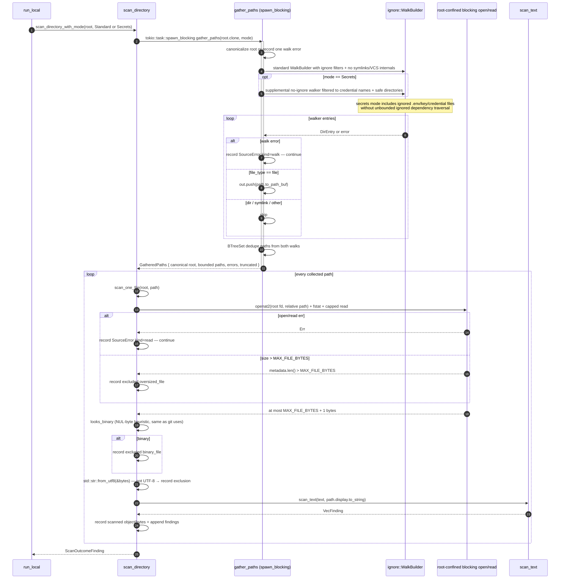
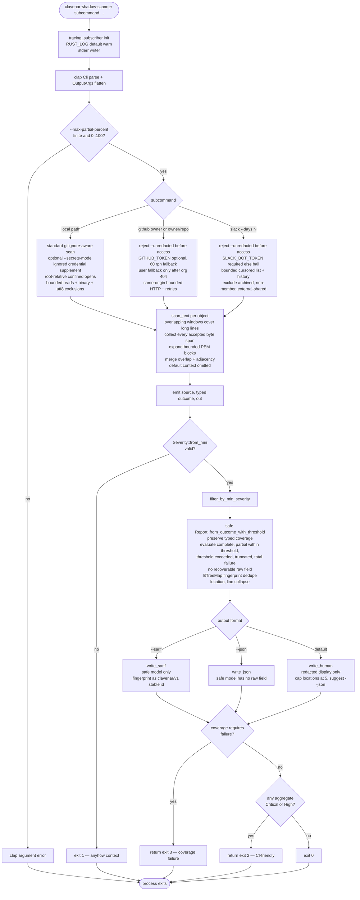

# clavenar-shadow-scanner sequence diagrams

Five sequence diagrams covering the wire-level paths the scanner can
take: CLI dispatch + the shared `emit` pipeline, the gitignore-aware
local-filesystem scan, the GitHub org / repo scan with rate-limit
backoff, the Slack workspace scan, and the per-line detector engine
that turns matched bytes into a typed `ScanOutcome` and deduped `Report`. A flowchart at the
end captures the request decision tree (source × output × severity
filter × exit code).

The scanner is a single CLI binary, so the diagrams highlight the
boundaries it crosses: the local filesystem (via the `ignore` crate),
`api.github.com` (REST + ETag-free polling), `slack.com/api`
(cursored history), and stdout (human / JSON / SARIF).

## 1. CLI dispatch + the shared `emit` pipeline

`main` reads as a sequential pipeline: tracing init (default `warn`)
→ clap `Cli::parse` → dispatch to one of three async runners → each
calls the safe `emit` path to filter, group, format, and choose exit 0/2/3 from
coverage policy and `any_high` aggregation (coverage failure exits 3 before a
finding can exit 2). Explicit local `--unredacted` dispatches through
`scan_directory_unredacted` and `emit_unredacted`; GitHub and Slack reject that
flag before source access, and clap rejects its use with SARIF.

```mermaid
sequenceDiagram
    autonumber
    participant Op as Operator shell
    participant Main as main
    participant Cli as clap Cli::parse
    participant Run as run_local / run_github / run_slack
    participant Src as sources::mod::scan_*
    participant Emit as emit
    participant Sev as Severity::from_min + filter_by_min_severity
    participant Rep as Report / UnsafeReport
    participant Out as write_human / write_json / write_sarif

    Op->>Main: clavenar-shadow-scanner subcommand [...]
    Main->>Main: tracing_subscriber::registry + EnvFilter (default warn, stderr writer)
    Main->>Cli: parse argv + env
    Cli-->>Main: Cli { command, local secrets_mode, OutputArgs { json, sarif, unredacted, severity_min, max_partial_percent } }
    break Command::Local with --unredacted
        Main->>Run: run_local(path, out)
        Run->>Src: sources::local::scan_directory_unredacted(path)
        Src-->>Run: ScanOutcomeUnsafeFinding (raw retained deliberately + typed coverage)
        Run->>Emit: emit_unredacted(source, outcome, out)
        Emit->>Rep: UnsafeReport::from_outcome_with_threshold
        Note over Emit,Rep: human banner; JSON unsafe_output=true + warning; no SARIF writer
        Rep-->>Emit: UnsafeReport carrying mandatory warning
        Emit->>Out: write unsafe human or JSON
        Out-->>Op: visibly marked secret-bearing payload
    end
    alt Command::Local safe default
        Main->>Run: run_local(path, secrets_mode, out)
        Run->>Src: sources::local::scan_directory_with_mode(path, mode)
    else Command::Github
        Main->>Run: run_github(owner_arg, include_forks, include_archived, out)
        Run->>Run: reject --unredacted before client/source access
        Run->>Run: split owner/repo on first '/'
        Run->>Src: sources::github::scan_owner(client, owner, repo_filter, include_forks, include_archived)
    else Command::Slack
        Main->>Run: run_slack(days, out)
        Run->>Run: reject --unredacted before token/source access
        Run->>Src: sources::slack::scan_workspace(client, lookback_days)
    end
    Src-->>Run: ScanOutcomeFinding (safe findings + typed coverage)
    Run->>Emit: emit(source_label, outcome, out)
    Emit->>Sev: Severity::from_min(out.severity_min) — error if invalid
    Sev->>Emit: Severity enum
    Emit->>Sev: outcome.map_findings(filter_by_min_severity)
    Sev-->>Emit: filtered ScanOutcomeFinding
    Emit->>Rep: Report::from_outcome_with_threshold(source, filtered outcome, max_partial_percent)
    Note over Emit,Rep: safe Finding, Aggregate, and Report models contain no recoverable raw value
    Rep-->>Emit: Report { source, scanned_at, coverage, coverage_evaluation, aggregates, total_findings }
    alt out.sarif
        Emit->>Out: report.write_sarif(stdout)
    else out.json
        Emit->>Out: report.write_json(stdout)
    else
        Emit->>Out: report.write_human(stdout)
    end
    Out-->>Op: stdout payload
    alt coverage status is threshold_exceeded, truncated, or total_failure
        Emit-->>Op: return exit 3 — coverage failure takes precedence
    else accepted coverage
        Emit->>Emit: any_high = aggregates.iter().any(Critical or High)
    end
    alt accepted coverage and any_high
        Emit-->>Op: return exit 2  — CI-friendly
    else accepted coverage and no critical or high (or filtered out)
        Emit-->>Op: exit 0
    end
    Note over Main,Op: item/source failures stay in coverage; setup or fatal errors before an outcome exit 1
```

## 2. `local` — gitignore-aware filesystem walk

`scan_directory_with_mode` canonicalizes the requested root, pushes the
synchronous `ignore::WalkBuilder` walk onto the blocking pool, deduplicates
candidate paths, then opens + scans each file on the blocking pool. Standard mode
uses normal ignore filters while excluding VCS internals and symlinks. Secrets
mode supplements that set with ignored credential-oriented filenames, without
entering VCS, dependency, build, virtualenv, or cache directories. Linux opens
are relative to the canonical root through `openat2` with `BENEATH`,
`NO_SYMLINKS`, and `NO_MAGICLINKS`; the read itself is capped at 1 MiB + 1
byte. The NUL-byte binary heuristic and UTF-8 check short-circuit before regex
work. Binary, oversized, and non-UTF-8 files become visible intentional
exclusions. Individual file failures become
structured source errors while other readable files continue. Every scanned,
excluded, skipped, and errored item contributes to the returned coverage state.

```mermaid
sequenceDiagram
    autonumber
    participant Run as run_local
    participant Scan as scan_directory
    participant Gather as gather_paths (spawn_blocking)
    participant Ignore as ignore::WalkBuilder
    participant Open as root-confined blocking open/read
    participant Det as scan_text

    Run->>Scan: scan_directory_with_mode(root, Standard or Secrets)
    Scan->>Gather: tokio::task::spawn_blocking gather_paths(root.clone, mode)
    activate Gather
    Gather->>Gather: canonicalize root or record one walk error
    Gather->>Ignore: standard WalkBuilder with ignore filters + no symlinks/VCS internals
    opt mode == Secrets
        Gather->>Ignore: supplemental no-ignore walker filtered to credential names + safe directories
    end
    Note over Ignore: secrets mode includes ignored .env/key/credential files<br/>without unbounded ignored dependency traversal
    loop walker entries
        Ignore-->>Gather: DirEntry or error
        alt walk error
            Gather->>Gather: record SourceError kind=walk — continue
        else file_type == file
            Gather->>Gather: out.push(path.to_path_buf)
        else dir / symlink / other
            Gather->>Gather: skip
        end
    end
    Gather->>Gather: BTreeSet dedupe paths from both walks
    Gather-->>Scan: GatheredPaths { canonical root, bounded paths, errors, truncated }
    deactivate Gather
    loop every collected path
        Scan->>Scan: scan_one_file(root, path)
        Scan->>Open: openat2(root fd, relative path) + fstat + capped read
        alt open/read err
            Open-->>Scan: Err
            Scan->>Scan: record SourceError kind=read — continue
        else size > MAX_FILE_BYTES
            Open-->>Scan: metadata.len() > MAX_FILE_BYTES
            Scan->>Scan: record excluded oversized_file
        end
        Open-->>Scan: at most MAX_FILE_BYTES + 1 bytes
        Scan->>Scan: looks_binary (NUL-byte heuristic, same as git uses)
        alt binary
            Scan->>Scan: record excluded binary_file
        end
        Scan->>Scan: std::str::from_utf8(&bytes) — not UTF-8 → record exclusion
        Scan->>Det: scan_text(text, path.display.to_string)
        Det-->>Scan: VecFinding
        Scan->>Scan: record scanned object/bytes + append findings
    end
    Scan-->>Run: ScanOutcomeFinding
```

## 3. `github` — owner-or-repo scan with rate-limit backoff

`GitHubClient::from_env` pulls an optional `GITHUB_TOKEN` (unset
falls back to the 60-req/hour public ceiling). `scan_owner` either
fetches one named repo or paginates `/orgs/{owner}/repos` →
`/users/{owner}/repos` (the user fallback runs only when the organization
endpoint returns 404; an empty organization stays empty). Every URL component
is percent encoded, pagination must remain on the configured HTTPS origin,
redirects are disabled, response bodies/pages are bounded, and rate-limit
retries have a fixed attempt ceiling.

```mermaid
sequenceDiagram
    autonumber
    participant Run as run_github
    participant Cli as GitHubClient::from_env
    participant Scan as scan_owner
    participant List as list_repos / paginate_repos
    participant Tree as list_tree
    participant Blob as fetch_blob (get_raw)
    participant Det as scan_text
    participant Gh as api.github.com

    Run->>Cli: from_env — reads GITHUB_TOKEN (Option), base_url default
    Cli-->>Run: GitHubClient
    Run->>Run: split owner_arg on '/' → (owner, Optionrepo)
    Run->>Scan: scan_owner(client, owner, repo_filter, include_forks, include_archived)
    alt repo_filter is Some(name)
        Scan->>Gh: GET /repos/{owner}/{name} (via get_json + retry loop)
        Gh-->>Scan: RepoSummary
    else
        Scan->>List: list_repos(owner)
        List->>List: request /orgs/{owner}/repos
        alt organization endpoint returns 404
            List->>List: request /users/{owner}/repos
        end
        loop bounded same-origin Link rel=next pages
            List->>List: paginate_repos(url)
            loop while next Link rel=next
                List->>Gh: GET url + Bearer GITHUB_TOKEN + Accept: application/vnd.github+json
                alt 403 + X-RateLimit-Remaining: 0
                    Gh-->>List: 403 + reset header
                    List->>List: sleep clamp(reset - now, 1, 600) — retry
                else 429
                    Gh-->>List: 429
                    List->>List: sleep 30s — retry
                else non-2xx
                    Gh-->>List: status; bounded body omitted from errors
                    List-->>Scan: source error
                else 2xx
                    Gh-->>List: page JSON + Link header
                    List->>List: parse next_link — all.extend(page)
                end
            end
            List-->>Scan: bounded VecRepoSummary
        end
    end
    loop every repo
        alt !include_forks AND repo.fork
            Scan->>Scan: record excluded fork_repository
        else !include_archived AND repo.archived
            Scan->>Scan: record excluded archived_repository
        else
            Scan->>Tree: list_tree(owner, repo.name, repo.default_branch)
            Tree->>Gh: GET /repos/.../git/trees/{branch}?recursive=1
            Gh-->>Tree: TreeResponse { tree, truncated }
            Tree-->>Scan: TreeListing { blob entries, truncated }
            opt truncated == true
                Scan->>Scan: mark coverage truncated + partial
            end
            loop every blob
                alt size > MAX_FILE_BYTES OR has_binary_extension(path)
                    Scan->>Scan: record intentional blob exclusion
                else
                    Scan->>Blob: fetch_blob(owner, repo, path, branch)
                    Blob->>Gh: GET /repos/.../contents/{path}?ref={branch} + Accept: application/vnd.github.raw
                    Gh-->>Blob: raw bytes (rate-limit-loop applies)
                    Blob-->>Scan: bytes
                    Scan->>Scan: looks_binary OR utf8 decode fail → record exclusion
                    Scan->>Det: scan_text(text, "{owner}/{repo}:{path}@{branch}")
                    Det-->>Scan: VecFinding
                    Scan->>Scan: record scanned object/bytes + extend findings
                end
            end
        end
    end
    Scan-->>Run: ScanOutcomeFinding
```

## 4. `slack` — workspace scan with cursor-paginated history

`SlackClient::from_env` requires `SLACK_BOT_TOKEN` (errors out at
boot if unset — required scopes documented in
`src/sources/slack.rs`). `scan_workspace` lists every conversation
the bot is a member of (cursor-paginated), skips archived /
non-member/external-shared rooms, then pages `conversations.history` for each
remaining channel back to `now - lookback_days`. Slack returns
`{ ok: false, error }` with a 200 status, so every paged response is
parsed and the `ok` flag inspected before consuming `messages`. The lookback is
restricted to 1–3650 days; redirects are disabled, URLs stay on the configured
HTTPS origin, and response bodies, pagination, cursors, retries, messages, and
aggregate findings all have explicit ceilings.

```mermaid
sequenceDiagram
    autonumber
    participant Run as run_slack
    participant Cli as SlackClient::from_env
    participant Scan as scan_workspace
    participant Conv as list_conversations
    participant Hist as fetch_history
    participant Det as scan_text
    participant Sl as slack.com/api

    Run->>Cli: from_env — SLACK_BOT_TOKEN required else bail
    Cli-->>Run: SlackClient (base https://slack.com/api)
    Run->>Scan: scan_workspace(client, lookback_days)
    Scan->>Conv: list_conversations
    loop until response_metadata.next_cursor empty
        Conv->>Sl: GET /users.conversations?limit=200&types=public_channel,private_channel + Bearer token
        Sl-->>Conv: { ok, channels, response_metadata: { next_cursor } }
        alt ok == false
            Conv-->>Scan: typed conversation_list source error
        else
            Conv->>Conv: out.extend(channels) — set cursor or break
        end
    end
    Conv-->>Scan: VecConversation
    Scan->>Scan: since_ts = Utc::now - Duration::days(lookback_days)
    loop every conversation
        alt archived, non-member, or external-shared
            Scan->>Scan: record intentional conversation exclusion
        else
            Scan->>Hist: fetch_history(channel_id, since_ts)
            loop until next_cursor empty
                Hist->>Sl: GET /conversations.history?channel=...&oldest=since_ts&limit=200 + Bearer
                Sl-->>Hist: { ok, messages, response_metadata }
                alt ok == false
                    Hist-->>Scan: typed channel_history source error
                else
                    Hist->>Hist: out.extend(messages) — set cursor or break
                end
            end
            Hist-->>Scan: VecSlackMessage
            loop every message
                alt msg.text.is_empty
                    Scan->>Scan: record excluded empty_message
                else
                    Scan->>Det: scan_text(msg.text, "slack://{channel_label}/{ts}")
                    Det-->>Scan: VecFinding
                    Scan->>Scan: record scanned object/bytes + extend findings
                end
            end
            Scan->>Scan: tracing::info scanned slack channel <label>
        end
    end
    Note over Hist,Scan: per-channel fetch_history error → typed channel_history error; whole-workspace scan continues
    Scan-->>Run: ScanOutcomeFinding
```

## 5. Detector engine — `scan_text` + `Report::from_outcome`

The detector engine is shared by all three sources. Every detector runs over
each line; lines above 4 KiB are split into overlapping UTF-8-safe windows so
regex work stays bounded without dropping coverage. Matches that clear
`min_length` and `min_entropy` (Shannon, bits per
byte) are first recorded as absolute byte spans. Bounded PEM matches
expand through their matching footer. After the complete input has been
scanned, overlapping and adjacent spans are merged. The default `scan_text`
returns context-free safe findings. Explicit `scan_text_with_context` callers
get a best-effort ±2-line window rendered from that complete redaction set;
if the window includes an oversized line, or a PEM block is unterminated,
context is omitted rather than rendered unsafely.
The default path computes the fingerprint and redacted display value while the
match is in scope, then drops matched plaintext before returning. `Report` then
groups by that fingerprint (so the same key in 12 files becomes one entry with 12
locations), dedupes inside an aggregate by `(location, line)` to
collapse the vendor-vs-generic-backstop overlap, and keeps the
highest-severity detector name on conflict.

```mermaid
sequenceDiagram
    autonumber
    participant Caller as source::scan_*
    participant Scan as scan_text
    participant Det as Detector (per entry in detectors())
    participant H as shannon_entropy
    participant Span as merge_spans
    participant Ctx as build_context
    participant Rep as Report::from_outcome
    participant FP as fingerprint + redact while raw span is in scope

    Caller->>Scan: scan_text(text, location)
    loop every line (idx, line)
        Scan->>Scan: make one window or overlapping 4 KiB UTF-8-safe windows
        loop every window
            loop every detector
                Scan->>Det: pattern.captures_iter(window)
                loop every captured match
                    Det-->>Scan: caps.get(1).or(caps.get(0))
                    alt min_length set AND raw.len < min_length
                        Scan->>Scan: skip
                    else min_entropy set
                        Scan->>H: shannon_entropy(raw)
                        H-->>Scan: bits/byte
                        alt entropy < min_entropy
                            Scan->>Scan: skip — suppresses identifiers that look pattern-shaped
                        end
                    end
                    Scan->>Scan: pending.push exact absolute byte span
                end
            end
        end
    end
    Scan->>Span: sort + merge overlapping or adjacent accepted spans
    Span-->>Scan: complete normalized redaction set
    loop every pending finding
        alt explicit context API and bounded PEM/window
            Scan->>Ctx: build_context(text, line_idx, merged spans)
            Ctx->>Ctx: redact every span intersecting lines[lo..hi]
            Ctx-->>Scan: 5-line redacted window
        else safe rendering cannot be proven
            Scan->>Scan: context = None
        end
        Scan->>FP: full sha256(raw span) + redact(raw span)
        FP-->>Scan: fingerprint + redacted display value
        Scan->>Scan: out.push Finding { detector, severity, location, line, fingerprint, redacted, context }
    end
    Scan-->>Caller: VecFinding — no recoverable raw field

    Caller->>Rep: Report::from_outcome_with_threshold(source, ScanOutcome { findings, coverage }, max_partial_percent)
    Rep->>Rep: evaluate coverage<br/>incomplete = skipped + source errors<br/>attempted = scanned + incomplete<br/>strict threshold; truncation and total failure always fail
    loop every finding
        Rep->>Rep: BTreeMap entry-or-insert Aggregate { fingerprint, detector, severity, redacted, locations: [] }
        alt f.severity < entry.severity
            Rep->>Rep: entry.severity = f.severity — entry.detector = f.detector — higher tier wins
        end
        alt locations contains (location, line)
            Rep->>Rep: skip — vendor and generic backstop fired on same physical hit
        else
            Rep->>Rep: entry.locations.push Location { location, line, context }
        end
    end
    Rep->>Rep: collect into Vec — sort by (severity ASC, detector, fingerprint) for stable diff
    Rep-->>Caller: Report { source, scanned_at: Utc::now, coverage, coverage_evaluation, aggregates, total_findings }
```

## 6. Request decision tree (flowchart)

A single CLI invocation fans out across four orthogonal knobs: the
source subcommand, the output format, the redaction posture, and
the severity-min cutoff. Coverage is evaluated first; a total source failure,
truncation, or incomplete percentage strictly above the configured threshold
exits `3`. Only accepted coverage proceeds to finding exit `2` or clean exit
`0`.

```mermaid
flowchart TD
    Start([clavenar-shadow-scanner subcommand ...]) --> Tracing[tracing_subscriber init<br/>RUST_LOG default warn<br/>stderr writer]
    Tracing --> Parse[clap Cli parse + OutputArgs flatten]
    Parse --> Threshold{--max-partial-percent<br/>finite and 0..100?}
    Threshold -->|no| ArgErr[clap argument error]
    Threshold -->|yes| Sub{subcommand}

    Sub -->|local path| L[standard gitignore-aware scan<br/>optional --secrets-mode ignored credential supplement<br/>root-relative confined opens<br/>bounded reads + binary + utf8 exclusions]
    Sub -->|github owner or owner/repo| G[reject --unredacted before access<br/>GITHUB_TOKEN optional, 60 rph fallback<br/>user fallback only after org 404<br/>same-origin bounded HTTP + retries]
    Sub -->|slack --days N| S[reject --unredacted before access<br/>SLACK_BOT_TOKEN required else bail<br/>bounded cursored list + history<br/>exclude archived, non-member, external-shared]

    L --> Det[scan_text per object<br/>overlapping windows cover long lines<br/>collect every accepted byte span<br/>expand bounded PEM blocks<br/>merge overlap + adjacency<br/>default context omitted]
    G --> Det
    S --> Det

    Det --> Emit[emit source, typed outcome, out]
    Emit --> SevMin{Severity::from_min<br/>valid?}
    SevMin -->|no| Err1[exit 1 — anyhow context]
    SevMin -->|yes| Filter[filter_by_min_severity]
    Filter --> Build[safe Report::from_outcome_with_threshold<br/>preserve typed coverage<br/>evaluate complete, partial within threshold,<br/>threshold exceeded, truncated, total failure<br/>no recoverable raw field<br/>BTreeMap fingerprint dedupe<br/>location, line collapse]

    Build --> Fmt{output format}
    Fmt -->|--sarif| Sarif[write_sarif<br/>safe model only<br/>fingerprint as clavenar/v1 stable id]
    Fmt -->|--json| Json[write_json<br/>safe model has no raw field]
    Fmt -->|default| Human[write_human<br/>redacted display only<br/>cap locations at 5, suggest --json]

    Sarif --> CoverageFail{coverage requires<br/>failure?}
    Json --> CoverageFail
    Human --> CoverageFail
    CoverageFail -->|yes| E3[return exit 3 — coverage failure]
    CoverageFail -->|no| AnyHigh{any aggregate<br/>Critical or High?}
    AnyHigh -->|yes| E2[return exit 2 — CI-friendly]
    AnyHigh -->|no| E0[exit 0]

    Err1 --> End([process exits])
    ArgErr --> End
    E0 --> End
    E2 --> End
    E3 --> End
```
